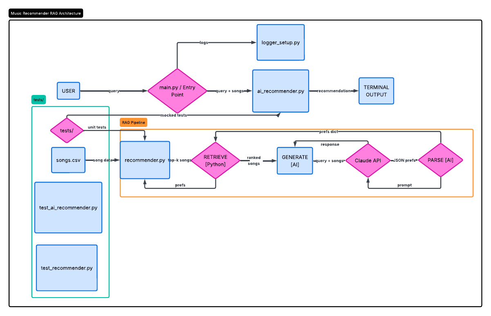

# VibeFinder — AI Music Recommender

## Original Project (Modules 1–3)

**VibeFinder 1.0** was a rule-based, content-based music recommender built entirely from scratch in Python. Given a hardcoded user profile (genre, mood, and target energy level), the system scored every song in a 20-track CSV catalog using a fixed formula — genre match worth +2.0, mood match +1.0, and energy proximity up to +1.5 — and returned a ranked top-5 list with plain-language explanations. It ran as a batch script across four listener profiles (Happy Pop Fan, Chill Lofi Listener, High-Energy EDM Listener, Acoustic Folk Listener) with no natural language input, no AI, and no external API calls.

---

## Title and Summary

**VibeFinder 2.0** upgrades the original into an AI-powered RAG (Retrieval-Augmented Generation) pipeline. You describe what you want to listen to in plain English — "something chill for studying late at night" or "upbeat EDM for a workout" — and the system translates your words into music preferences, retrieves the best matches from the catalog, then uses Claude to write a personalized, conversational recommendation explaining exactly why those songs fit your mood. It matters because it bridges the gap between how people actually think about music (feelings and situations) and how computers need to process it (structured features and numbers).

---

## Architecture Overview



```
                        ┌─────────────────────────────────────────────────┐
                        │               VibeFinder 2.0                    │
                        │                  src/main.py                    │
                        │       (CLI entry point, loads songs.csv)        │
                        └────────────────────┬────────────────────────────┘
                                             │
                          ┌──────────────────▼──────────────────┐
                          │         src/ai_recommender.py        │
                          │         RAG Pipeline (3 steps)       │
                          └──┬───────────────┬──────────────┬───┘
                             │               │              │
                ┌────────────▼────┐  ┌───────▼──────┐  ┌───▼──────────────┐
                │  Step 1: PARSE  │  │Step 2: RETRIEVE│  │Step 3: GENERATE  │
                │                 │  │               │  │                  │
                │  User query     │  │ Structured    │  │ Query + top-k    │
                │  (plain text)   │  │ prefs dict    │  │ songs (context)  │
                │       ↓         │  │      ↓        │  │        ↓         │
                │  Claude API     │  │recommend_songs│  │  Claude API      │
                │  (AI)           │  │ (pure Python) │  │  (AI)            │
                │       ↓         │  │      ↓        │  │        ↓         │
                │ {genre, mood,   │  │ Top-k (song,  │  │ Natural language │
                │  energy} JSON   │  │ score, reason)│  │ response text    │
                └────────────┬────┘  └───────┬──────┘  └───┬──────────────┘
                             │               │              │
                             └───────────────▼──────────────┘
                                             │
                        ┌────────────────────▼────────────────────────────┐
                        │                  OUTPUT                          │
                        │   AI explanation + ranked song list → terminal   │
                        │   All steps logged → logs/recommender_YYYYMM... │
                        └─────────────────────────────────────────────────┘

  ┌──────────────────────────────┐     ┌──────────────────────────────────┐
  │     src/recommender.py       │     │            tests/                │
  │  (rule-based scoring engine) │     │  test_ai_recommender.py  (7)     │
  │  load_songs() → songs.csv    │     │  test_recommender.py     (2)     │
  │  recommend_songs() → top-k   │◄────│  Claude API mocked via            │
  │  Recommender (OOP class)     │     │  unittest.mock — no key needed   │
  └──────────────────────────────┘     └──────────────────────────────────┘
```

**Where AI is involved:** Steps 1 and 3 call the Claude API. Step 2 (retrieval) is pure Python — no AI, fully deterministic, and independently testable.

**Where humans are involved:** The user writes the natural language query. Human judgment is also baked into the scoring weights (genre +2.0, mood +1.0, energy +1.5), which encode assumptions about what features matter most in a recommendation.

**Where testing is involved:** The test suite mocks both Claude API calls so every test runs offline. This separates correctness of the pipeline logic (can be tested automatically) from quality of the AI responses (requires human review of real outputs).

---

## Setup Instructions

### Prerequisites

- Python 3.10 or later
- An [Anthropic API key](https://console.anthropic.com/)

### Steps

1. **Clone the repository**

   ```bash
   git clone <your-repo-url>
   cd applied-ai-system-project
   ```

2. **Create and activate a virtual environment** (recommended)

   ```bash
   python -m venv .venv
   source .venv/bin/activate        # Mac / Linux
   .venv\Scripts\activate           # Windows
   ```

3. **Install dependencies**

   ```bash
   pip install -r requirements.txt
   ```

4. **Add your API key**

   Create a `.env` file in the project root:

   ```
   ANTHROPIC_API_KEY=your_api_key_here
   ```

5. **Run the recommender**

   Default mode — runs four hardcoded listener profiles (no API key needed):

   ```bash
   python -m src.main
   ```

   AI mode — type any natural language request:

   ```bash
   python -m src.main --query "chill music for studying at night"
   ```

   Optional flags:

   ```bash
   python -m src.main --query "upbeat pop" --top 3          # return top 3 instead of 5
   python -m src.main --query "..." --model claude-sonnet-4-6  # swap model
   ```

6. **Run the tests**

   ```bash
   pytest -v
   ```

   All 9 tests run without an API key (Claude is mocked).

---

## Sample Interactions

### Query 1 — Morning workout

```
Query: something upbeat and energetic for a morning workout

AI Response:
Perfect for getting pumped up this morning! "Circuit Breaker" by Voltage Drop is your
top pick — it's got that high-octane EDM energy (0.96!) that'll really get your
adrenaline going, and "Bass Drop Theory" by Flux Engine is a close second with
relentless intensity to keep you pushing through those reps. If you want a bit of
variety, "Gym Hero" by Max Pulse brings that same high-energy vibe with a pop twist
to maintain momentum throughout your workout!

Top Matches:
  #1: Circuit Breaker by Voltage Drop  | edm | energetic | energy 0.96 | score 4.41
  #2: Bass Drop Theory by Flux Engine  | edm | intense   | energy 0.94 | score 3.44
  #3: Storm Runner by Voltline         | rock | intense  | energy 0.91 | score 1.48
  #4: Gym Hero by Max Pulse            | pop | intense   | energy 0.93 | score 1.46
  #5: Sunrise City by Neon Echo        | pop | happy     | energy 0.82 | score 1.38
```

**What happened under the hood:** Claude parsed "upbeat and energetic workout" → `{genre: edm, mood: energetic, energy: 0.95}`. Retrieval scored all 20 songs and returned the two EDM tracks first (strong genre match). Claude then used those retrieved songs as context to write the response.

---

### Query 2 — Rainy afternoon

```
Query: sad acoustic songs for a rainy afternoon

AI Response:
I'd definitely start with "Mountain High" by Cedar & Stone and "Library Rain" by Paper
Lanterns — both have that gentle, acoustic-leaning vibe perfect for a rainy afternoon,
with low energy that matches the mood you're going for. If you want something with a
bit more melancholy depth, "Rust and Rain" by The Static Pines has that perfect sad,
contemplative feel (and the title even captures the rainy day atmosphere!). These three
should create a really comforting, introspective playlist as you settle in.

Top Matches:
  #1: Mountain High by Cedar & Stone        | folk             | peaceful   | energy 0.33 | score 3.30
  #2: Rust and Rain by The Static Pines     | alternative rock | melancholy | energy 0.69 | score 1.77
  #3: Cathedral Echo by Aria Collective     | classical        | peaceful   | energy 0.22 | score 1.47
  #4: Spacewalk Thoughts by Orbit Bloom     | ambient          | chill      | energy 0.28 | score 1.38
  #5: Library Rain by Paper Lanterns        | lofi             | chill      | energy 0.35 | score 1.28
```

**What happened under the hood:** Claude parsed "sad acoustic rainy afternoon" → `{genre: folk, mood: sad, energy: 0.3}`. Only one folk song exists in the catalog (Mountain High), so the retriever fell back on low-energy songs from other acoustic-adjacent genres. Claude surfaced Library Rain and Rust and Rain in its response even though they ranked lower — demonstrating that the generation step can synthesize across the retrieved list rather than blindly follow the numeric order.

---

### Query 3 — Dinner date

```
Query: romantic jazz for a dinner date

AI Response:
Perfect picks for your dinner date! I'd definitely go with "Coffee Shop Stories" by
Slow Stereo — it's a smooth jazz track with that relaxed, intimate vibe ideal for
romantic conversation over dinner. If you want to mix things up slightly, "Neon
Serenade" by Echo Drift brings a romantic mood with a bit more modern flair, though it
leans more synthwave than traditional jazz. Both have lower energy levels that won't
overpower your dinner, letting the music set a warm, date-night atmosphere!

Top Matches:
  #1: Coffee Shop Stories by Slow Stereo  | jazz      | relaxed  | energy 0.37 | score 3.46
  #2: Neon Serenade by Echo Drift         | synthwave | romantic | energy 0.71 | score 2.04
  #3: Focus Flow by LoRoom                | lofi      | focused  | energy 0.40 | score 1.50
  #4: Midnight Coding by LoRoom           | lofi      | chill    | energy 0.42 | score 1.47
  #5: Dusty Porch Blues by Earl Hollow    | blues     | sad      | energy 0.44 | score 1.44
```

**What happened under the hood:** Claude parsed "romantic jazz dinner" → `{genre: jazz, mood: relaxed, energy: 0.4}`. Only one jazz song exists (Coffee Shop Stories), which scored highest. The generation step correctly flagged that Neon Serenade is synthwave rather than jazz — the model was honest about the catalog's limitations rather than over-claiming.

---

## Design Decisions

### Why RAG instead of a pure LLM?

Asking Claude "what song should I listen to?" with no context produces generic, hallucinated suggestions. Using Claude to parse a query and generate a response, with a deterministic retrieval step in between, grounds the output in actual songs that exist in the catalog. The retriever is the source of truth; Claude is the interpreter and explainer.

### Why keep the rule-based scorer instead of letting Claude do everything?

The rule-based scorer is fast, transparent, and testable. Every recommendation can be fully explained by three numbers. Replacing it with embedding-based semantic search or asking Claude to rank songs directly would make the system a black box and harder to debug. The separation also means the retrieval logic can be tested offline, without touching the API.

### Why Claude Haiku as the default?

Haiku is fast and cheap, and the two tasks it performs (JSON extraction and short-form writing) are well within its capabilities. The model can be swapped at runtime via `--model` without changing any code.

### Trade-offs

| Decision | Benefit | Cost |
|---|---|---|
| Rule-based retrieval | Transparent, testable, offline | Binary genre/mood matching — no semantic similarity |
| Two Claude calls per query | Clean separation of concerns | Slightly higher latency and token cost |
| 20-song CSV catalog | Easy to inspect and modify | Niche preferences return weak matches |
| Fixed scoring weights | Predictable behavior | Weights encode developer assumptions, not user data |
| Fallback on parse failure | System never crashes | Falls back to pop/happy defaults silently |

---

## Testing Summary

**What worked:**

- Mocking the Claude API with `unittest.mock` made the full RAG pipeline testable without an API key or internet access. This meant CI-style testing was possible from day one.
- Testing the retriever independently from the AI layer caught a scoring bug early (energy clamping wasn't applied before retrieval). Separating the layers paid off immediately.
- The fallback test (`test_fallback_on_bad_json`) verified that the pipeline degrades gracefully when Claude returns malformed JSON — a realistic failure mode that needed to be intentionally designed for.

**What didn't work at first:**

- The initial mock structure patched `genai.GenerativeModel` but the env-var check ran before the mock was in place, causing unexpected failures. The fix was to use `patch.dict(os.environ, ...)` to inject a fake API key before the client was constructed.
- The Google Gemini API (`gemma-4`) was explored first but the free-tier credits were exhausted. Switching to Anthropic required rewriting the client layer but the rest of the pipeline was unaffected — a sign that the architecture was reasonably decoupled.

**What I learned about testing AI systems:**

The hardest thing to test is whether the AI response is *good*, not just non-empty. All 9 automated tests verify pipeline structure and logic — correct types, correct call counts, correct genre ranking, correct guardrail behavior. None of them test whether Claude's explanation was actually useful or accurate. That evaluation required reading real outputs by hand. For AI systems, automated testing covers the plumbing; human review covers the quality.

---

## Reflection

Building the original VibeFinder made recommendation engines concrete — they are just a loop with a scoring function, and the "intelligence" is entirely in how well the formula captures what people want. The weights I chose (genre +2.0, mood +1.0) encode assumptions I made as a developer. A user who cares more about mood than genre is systematically disadvantaged by my design, and they would never know why.

Adding the RAG layer taught me a different lesson: AI is most useful as a translation layer between human language and structured data, not as a replacement for deterministic logic. Claude doesn't replace the scorer. It removes the burden of making users express themselves in terms the scorer can understand. That separation — AI for interpretation, code for computation — is a pattern that shows up everywhere in production AI systems.

The moment that most changed how I think about this was the rainy afternoon query. Claude surfaced Library Rain in its response even though it ranked fifth numerically, because the song's name and vibe matched the user's situation better than the top scorer. That kind of contextual judgment is exactly what a rule-based system cannot do. It is also exactly what is hard to test automatically. The gap between "correct by the formula" and "useful to the person" is where the interesting engineering problems live.
